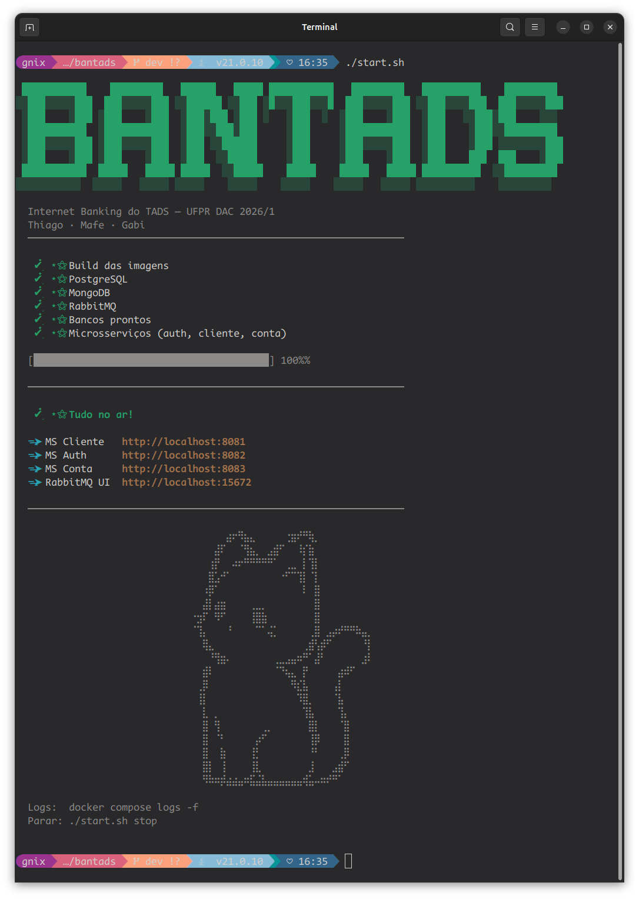

# BANTADS - Internet Banking do TADS

Sistema de Internet Banking desenvolvido para a disciplina DS152 - Desenvolvimento de Aplicações Corporativas (UFPR - TADS).

O BANTADS é um sistema bancário com três perfis de acesso (Cliente, Gerente e Administrador), construído sobre uma arquitetura de microsserviços com comunicação assíncrona via mensageria.

---

## Sumário

- [Arquitetura](#arquitetura)
- [Status](#status)
- [Como rodar](#como-rodar)
- [Endpoints](#endpoints)
- [Dados de teste](#dados-de-teste)
- [Equipe](#equipe)

---

## Arquitetura

O sistema segue uma arquitetura de microsserviços com os seguintes componentes:

```
                                    ┌─────────────────┐
                                    │    RabbitMQ      │
                                    │  (mensageria)    │
                                    └────────┬────────┘
                                             │
┌──────────┐    HTTP     ┌──────────────┐    │    ┌──────────────┐
│          │────────────>│              │────────>│  MS Cliente   │──> PostgreSQL (schema_cliente)
│ Frontend │             │  API Gateway │────────>│  MS Conta     │──> PostgreSQL (schema_conta_cud / schema_conta_read)
│ (SPA)    │<────────────│  (Node.js)   │────────>│  MS Gerente   │──> PostgreSQL (schema_gerente)
│          │             │              │────────>│  MS Auth      │──> MongoDB (db_auth)
└──────────┘             └──────────────┘    │    └──────────────┘
                                             │
                                    ┌────────┴────────┐
                                    │ SAGA Orquestrador│
                                    │  (coordenação)   │
                                    └─────────────────┘
```

**Padrões utilizados:** API Gateway, Database per Service (schema-per-service), CQRS (ms-conta), SAGA Orquestrada, API Composition.

**Tecnologias:** Spring Boot 4 (Java 21), Angular 21, PostgreSQL 17, MongoDB 7, RabbitMQ 4.2, Docker.

---

## Status

| Componente | Responsável | Porta | Status |
|---|---|---|---|
| MS Cliente | Gabi | 8081 | Pronto (CRUD + autocadastro + aprovação) |
| MS Auth | Mafe | 8082 | Pronto (login JWT + reboot) |
| MS Conta | Gabi | 8083 | Pronto (saldo, depósito, saque, transferência, extrato, reboot) |
| MS Gerente | Mafe | — | Em desenvolvimento |
| API Gateway | Thiago | — | Pendente |
| SAGA Orquestrador | Gabi | — | Pendente |
| Frontend | Thiago | 4200 | Em desenvolvimento (telas de cliente) |
| CQRS (ms-conta) | Gabi | — | Pendente (sync RabbitMQ) |

---

## Como rodar

### Pré-requisitos

- Docker e Docker Compose
- Node.js 20+ (para o frontend)
- Java 21 (para desenvolvimento local)

### Subindo o backend

```bash
# 1. clone o repositório
git clone git@github.com:gab-i-alves/bantads.git
cd bantads

# 2. crie o arquivo .env a partir do exemplo
cp env.example .env
# preencha as variáveis no .env

# 3. rode o script
./start.sh
```

O script builda as imagens, sobe a infraestrutura (PostgreSQL, MongoDB, RabbitMQ) e depois os microsserviços.



```bash
./start.sh          # sobe tudo
./start.sh build    # só builda as imagens
./start.sh stop     # para os containers
./start.sh clean    # para e apaga os volumes (reset total)
```

### Subindo o frontend

```bash
cd bantads-ui
npm install
npx ng serve
```

Acesse `http://localhost:4200`.

### Resetando os dados

Para resetar os bancos pro estado inicial da spec:

```bash
curl http://localhost:8082/reboot   # ms-auth
curl http://localhost:8083/reboot   # ms-conta
```

---

## Endpoints

### MS Cliente (porta 8081)

| Método | Rota | Descrição | Requisito |
|---|---|---|---|
| POST | `/clientes` | Autocadastro | R1 |
| GET | `/clientes` | Listar clientes (filtro: para_aprovar) | R9, R12 |
| GET | `/clientes/{cpf}` | Consultar cliente por CPF | R13 |
| PUT | `/clientes/{cpf}` | Alterar perfil | R4 |
| POST | `/clientes/{cpf}/aprovar` | Aprovar cliente | R10 |
| POST | `/clientes/{cpf}/rejeitar` | Rejeitar cliente | R11 |

### MS Conta (porta 8083)

| Método | Rota | Descrição | Requisito |
|---|---|---|---|
| GET | `/contas/{numero}/saldo` | Consultar saldo | R3 |
| POST | `/contas/{numero}/depositar` | Depositar | R5 |
| POST | `/contas/{numero}/sacar` | Sacar (valida saldo + limite) | R6 |
| POST | `/contas/{numero}/transferir` | Transferir entre contas | R7 |
| GET | `/contas/{numero}/extrato` | Extrato (filtro: inicio, fim) | R8 |
| GET | `/reboot` | Reset dos dados | — |

### MS Auth (porta 8082)

| Método | Rota | Descrição |
|---|---|---|
| POST | `/auth/login` | Login (retorna JWT) |
| GET | `/reboot` | Reset das contas de auth |

---

## Dados de teste

Após o `/reboot`, os seguintes dados estão disponíveis:

### Clientes

| Nome | CPF | Email | Senha | Conta | Saldo | Limite | Gerente |
|---|---|---|---|---|---|---|---|
| Catharyna | 12912861012 | cli1@bantads.com.br | tads | 1291 | R$ 800,00 | R$ 5.000,00 | Geniéve |
| Cleuddônio | 09506382000 | cli2@bantads.com.br | tads | 0950 | R$ -10.000,00 | R$ 10.000,00 | Godophredo |
| Catianna | 85733854057 | cli3@bantads.com.br | tads | 8573 | R$ -1.000,00 | R$ 1.500,00 | Gyândula |
| Cutardo | 58872160006 | cli4@bantads.com.br | tads | 5887 | R$ 150.000,00 | R$ 0,00 | Geniéve |
| Coândrya | 76179646090 | cli5@bantads.com.br | tads | 7617 | R$ 1.500,00 | R$ 0,00 | Godophredo |

### Gerentes / Admin

| Nome | CPF | Email | Senha | Tipo |
|---|---|---|---|---|
| Geniéve | 98574307084 | ger1@bantads.com.br | tads | Gerente |
| Godophredo | 64065268052 | ger2@bantads.com.br | tads | Gerente |
| Gyândula | 23862179060 | ger3@bantads.com.br | tads | Gerente |
| Adamântio | 40501740066 | adm1@bantads.com.br | tads | Administrador |

---

## Equipe

Trabalho desenvolvido para a disciplina DS152 - DAC, UFPR - TADS, 2026/1.

| Membro | Responsabilidade |
|---|---|
| Thiago | Frontend (Angular + TypeScript) + API Gateway |
| Mafe | MS Auth + MS Gerente + DevOps |
| Gabi | MS Cliente + MS Conta (CQRS) + SAGA Orquestrador |
