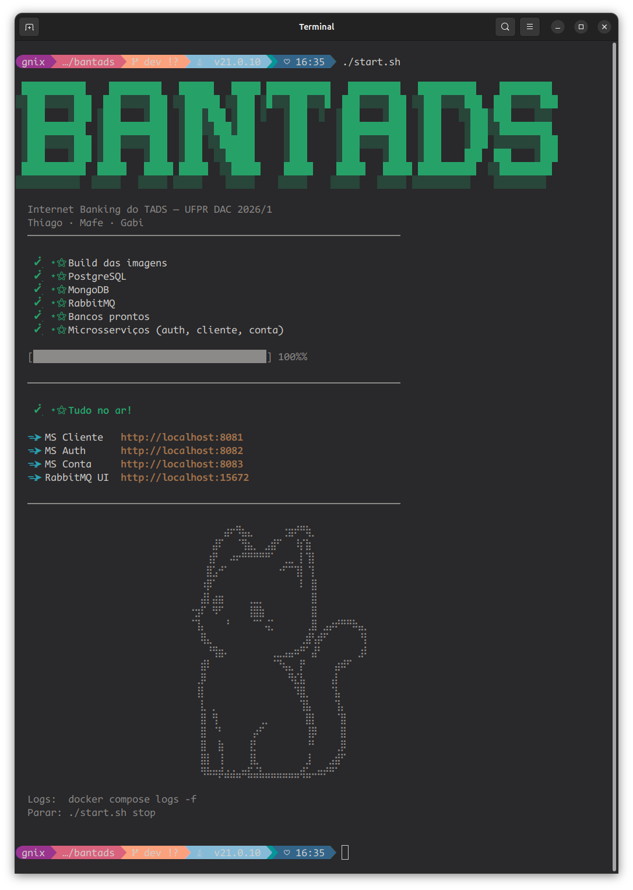

# BANTADS — Internet Banking do TADS

Sistema de Internet Banking desenvolvido para a disciplina **DS152 — Desenvolvimento de Aplicações Corporativas (DAC)**, UFPR — TADS.

O BANTADS é um sistema bancário com três perfis de acesso (**Cliente**, **Gerente** e **Administrador**), construído sobre arquitetura de microsserviços com comunicação assíncrona via mensageria, transações distribuídas com SAGA orquestrada e CQRS no serviço de contas.

---

## Sumário

- [Arquitetura](#arquitetura)
- [Padrões de projeto](#padrões-de-projeto)
- [Serviços e portas](#serviços-e-portas)
- [Como rodar](#como-rodar)
- [Contrato da API (gateway)](#contrato-da-api-gateway)
- [SAGAs](#sagas)
- [Mensageria (RabbitMQ)](#mensageria-rabbitmq)
- [Segurança](#segurança)
- [Dados de teste](#dados-de-teste)
- [Testes](#testes)
- [Estrutura do repositório](#estrutura-do-repositório)
- [Equipe](#equipe)

---

## Arquitetura

O front-end fala **exclusivamente** com o API Gateway, que é o único ponto de entrada do sistema. O gateway roteia para os microsserviços via HTTP-REST e agrega respostas (API Composition). Os microsserviços se comunicam entre si **apenas** via RabbitMQ (SAGA e sincronização CQRS). Cada serviço tem seu próprio banco/schema.

```
                                            ┌──────────────────┐
                                            │     RabbitMQ      │
                                            │   (mensageria)    │
                                            └─────────┬────────┘
                                  SAGA / CQRS / DLQ   │
        ┌──────────────┐   HTTP    ┌──────────────┐   │   ┌────────────────┐
        │              │──────────>│              │───────│  MS Cliente    │─> PostgreSQL  schema_cliente
        │  Frontend    │           │  API Gateway │───────│  MS Conta      │─> PostgreSQL  schema_conta_cud
        │  Angular/SPA │<──────────│   (Node.js)  │───────│  MS Funcionario│   + schema_conta_read  (CQRS)
        │  (nginx)     │   JSON    │   JWT + comp │───────│  MS Auth       │─> PostgreSQL  schema_funcionario
        └──────────────┘           └──────┬───────┘   │   └────────────────┘   MongoDB     (auth)
                                          │           │
                                          │    ┌──────┴───────────┐
                                          └───>│  MS Saga          │  orquestrador das transações
                                               │  (orquestrador)   │  distribuídas (sem banco próprio)
                                               └──────────────────┘
```

---

## Padrões de projeto

| Padrão | Onde |
|---|---|
| **Arquitetura de Microsserviços** | 5 microsserviços + API Gateway, conteinerizados individualmente |
| **API Gateway** | ponto único de entrada (Node.js/Express), JWT, roteamento e composição |
| **Database per Service / schema-per-service** | cada MS só acessa seu schema; auth em MongoDB, demais em PostgreSQL |
| **CQRS** | ms-conta separa escrita (`schema_conta_cud`) e leitura (`schema_conta_read`), sincronizados por RabbitMQ |
| **SAGA Orquestrada** | ms-saga coordena as 4 transações distribuídas, com compensação por etapa |
| **API Composition** | gateway agrega dados de múltiplos MS (R12, R14, R15, R16) com chamadas paralelas, timeout e resposta parcial tolerante a falhas |

**Tecnologias:** Spring Boot 4 (Java 21) · Angular 21 + Angular Material · Node.js (Express) · PostgreSQL 17 · MongoDB 7 · RabbitMQ 4.2 · Docker / Docker Compose.

---

## Serviços e portas

| Serviço | Tecnologia | Porta (host) | Banco | Responsabilidade |
|---|---|---|---|---|
| **API Gateway** | Node.js / Express | `3000` | — | ponto único de entrada, JWT, roteamento, composição |
| **MS Cliente** | Spring Boot | `8081` | PostgreSQL `schema_cliente` | clientes, autocadastro, aprovação/rejeição |
| **MS Auth** | Spring Boot | `8082` | MongoDB | autenticação JWT, hashing SHA256+SALT |
| **MS Conta** | Spring Boot | `8083` | PostgreSQL `schema_conta_cud` + `schema_conta_read` (CQRS) | contas, saldo, operações, extrato |
| **MS Funcionario** | Spring Boot | `8084` | PostgreSQL `schema_funcionario` | CRUD de gerentes e admin |
| **MS Saga** | Spring Boot | `8085` | — (estado em memória) | orquestrador das SAGAs |
| **Frontend (UI)** | Angular + nginx | `4200` | — | aplicação web (SPA) |
| **PostgreSQL** | Postgres 17 | `5432` | — | todos os schemas transacionais |
| **MongoDB** | Mongo 7 | `27017` | — | base de autenticação |
| **RabbitMQ** | RabbitMQ 4.2 | `5672` / `15672` (mgmt) | — | mensageria (SAGA, CQRS, DLQ) |

---

## Como rodar

### Pré-requisitos

- Docker e Docker Compose
- (opcional, para desenvolvimento) Node.js 20+ e Java 21

### Subindo tudo com um comando

```bash
# 1. clone o repositório
git clone https://github.com/gab-i-alves/bantads.git
cd bantads

# 2. crie o .env a partir do exemplo (o start.sh cria automaticamente se faltar)
cp env.example .env

# 3. suba o ambiente inteiro
./start.sh
```

O `start.sh` builda **todas** as imagens (5 MS + gateway + frontend), sobe a infraestrutura (PostgreSQL, MongoDB, RabbitMQ), os microsserviços, o gateway e a UI, e ao final dispara um **reboot automático** que carrega os dados pré-cadastrados da spec.



Subcomandos:

```bash
./start.sh          # sobe tudo (build + infra + MS + gateway + UI + reseed)
./start.sh build    # só builda as imagens
./start.sh stop     # para os containers
./start.sh clean    # para e apaga os volumes (reset total dos bancos)
./start.sh reboot   # recarrega os dados pré-cadastrados nos MSs
```

Ao final, acesse:

- **Frontend:** http://localhost:4200
- **API Gateway:** http://localhost:3000
- **RabbitMQ (management):** http://localhost:15672

### Resetar os dados

Um único `GET` no gateway faz fan-out de reboot para todos os microsserviços:

```bash
curl http://localhost:3000/reboot
```

---

## Contrato da API (gateway)

Todas as chamadas do front passam pelo gateway (`http://localhost:3000`). Endpoints autenticados exigem o header `Authorization: Bearer <token>`.

### Sessão

| Método | Rota | Descrição |
|---|---|---|
| POST | `/login` | `{login, senha}` → `{access_token, token_type, tipo, usuario}` |
| POST | `/logout` | invalida o token atual (revogação no gateway) |
| GET | `/reboot` | reseta as bases de todos os MS (fan-out) |

### Clientes

| Método | Rota | Descrição | Requisito |
|---|---|---|---|
| POST | `/clientes` | autocadastro (sem login) | R1 |
| GET | `/clientes?filtro=para_aprovar` | pendentes de aprovação | R9 |
| GET | `/clientes` (gerente) | clientes do gerente logado | R12 |
| GET | `/clientes?filtro=melhores_clientes` | 3 maiores saldos (global) | R14 |
| GET | `/clientes?filtro=adm_relatorio_clientes` | relatório completo (admin) | R16 |
| GET | `/clientes/{cpf}` | dados do cliente + conta | R13 |
| PUT | `/clientes/{cpf}` | alteração de perfil | R4 |
| POST | `/clientes/{cpf}/aprovar` | aprovar cliente | R10 |
| POST | `/clientes/{cpf}/rejeitar` | rejeitar cliente (com motivo) | R11 |

### Contas

| Método | Rota | Descrição | Requisito |
|---|---|---|---|
| GET | `/contas/{numero}/saldo` | consultar saldo | R3 |
| POST | `/contas/{numero}/depositar` | depositar | R5 |
| POST | `/contas/{numero}/sacar` | sacar (valida saldo + limite) | R6 |
| POST | `/contas/{numero}/transferir` | transferir entre contas | R7 |
| GET | `/contas/{numero}/extrato` | extrato (filtro `inicio`/`fim`) | R8 |

> Operações de cliente (R5/R6/R7) só são permitidas na própria conta — o gateway injeta `x-user-cpf`/`x-user-role` do token e o ms-conta valida a posse (403 caso contrário).

### Gerentes (admin)

| Método | Rota | Descrição | Requisito |
|---|---|---|---|
| GET | `/gerentes?filtro=dashboard` | dashboard do admin (clientes + somas por gerente) | R15 |
| GET | `/gerentes` | listagem de gerentes (ordenada por nome) | R19 |
| GET | `/gerentes/{cpf}` | consultar gerente | — |
| POST | `/gerentes` | inserir gerente (senha no form) | R17 |
| PUT | `/gerentes/{cpf}` | alterar nome/email/senha | R20 |
| DELETE | `/gerentes/{cpf}` | remover gerente | R18 |

---

## SAGAs

As transações distribuídas usam **SAGA orquestrada** (coordenada pelo `ms-saga` via RabbitMQ), cada etapa com sua ação compensatória:

| SAGA | Fluxo | Compensação |
|---|---|---|
| **Autocadastro / Aprovação** (R1/R10) | aprova cliente → escolhe gerente com menos contas → cria auth → cria conta → e-mail com senha | reverte conta, auth e aprovação na ordem inversa; e-mail de falha (R1) |
| **Alteração de Perfil** (R4) | atualiza cliente → recalcula limite | `REVERTER_ATUALIZACAO_CLIENTE` restaura o perfil anterior |
| **Inserção de Gerente** (R17) | consulta gerente com mais contas → cria auth → reatribui 1 conta | `REMOVER_GERENTE` + `REMOVER_AUTH_GERENTE` |
| **Remoção de Gerente** (R18) | verifica último gerente → reatribui contas ao de menos contas → remove gerente e auth | `REVERTER_REATRIBUICAO` devolve as contas |

Regras de negócio cobertas: limite = salário/2 se salário ≥ R$ 2.000 (senão 0), com piso no saldo negativo; número de conta aleatório de 4 dígitos; bloqueio da remoção do último gerente; seleção de gerente por menos/mais contas com desempate por menor saldo positivo.

---

## Mensageria (RabbitMQ)

- **SAGA:** exchange `saga.exchange` com filas de comando por serviço (`saga.cmd.cliente/conta/funcionario/auth`) e replies para o orquestrador (`saga.reply.orchestrator`).
- **CQRS (ms-conta):** exchange `conta.exchange` → fila `conta.sync` sincroniza o read-model após cada escrita.
- **Tolerância a falhas (DLQ):** dead-letter exchange `bantads.dlx` com uma fila `.dlq` por consumidor e retry limitado (3 tentativas) — mensagens que esgotam o retry vão para a DLQ em vez de virarem _poison_.
- Mensagens trafegam como JSON/DTO, consistentes entre produtores e consumidores.

---

## Segurança

- **JWT** emitido pelo ms-auth (claims `sub`, `role`, `email`, `cpf`, `jti`); o gateway valida assinatura/expiração e injeta contexto do usuário para os MS.
- **Senhas** armazenadas com **SHA-256 + SALT** (salt aleatório de 16 bytes por usuário; `hex(SHA-256(salt + senha))`), conforme exigido pela spec.
- **Logout** revoga o token no gateway (não vale mais mesmo dentro da validade).
- Apenas **DTOs** trafegam entre servidor e cliente (nunca entidades persistentes).

---

## Dados de teste

Após o `/reboot`, os seguintes dados ficam disponíveis (todos com senha `tads`):

### Clientes

| Nome | CPF | Email | Conta | Saldo | Limite | Gerente |
|---|---|---|---|---|---|---|
| Catharyna | 12912861012 | cli1@bantads.com.br | 1291 | R$ 800,00 | R$ 5.000,00 | Geniéve |
| Cleuddônio | 09506382000 | cli2@bantads.com.br | 0950 | R$ -10.000,00 | R$ 10.000,00 | Godophredo |
| Catianna | 85733854057 | cli3@bantads.com.br | 8573 | R$ -1.000,00 | R$ 1.500,00 | Gyândula |
| Cutardo | 58872160006 | cli4@bantads.com.br | 5887 | R$ 150.000,00 | R$ 0,00 | Geniéve |
| Coândrya | 76179646090 | cli5@bantads.com.br | 7617 | R$ 1.500,00 | R$ 0,00 | Godophredo |

### Gerentes / Admin

| Nome | CPF | Email | Tipo |
|---|---|---|---|
| Geniéve | 98574307084 | ger1@bantads.com.br | Gerente |
| Godophredo | 64065268052 | ger2@bantads.com.br | Gerente |
| Gyândula | 23862179060 | ger3@bantads.com.br | Gerente |
| Adamântio | 40501740066 | adm1@bantads.com.br | Administrador |

---

## Testes

O sistema é validado pelo testador oficial da disciplina (`test_bantads`), executado contra o gateway em `http://localhost:3000`:

```bash
cd test_bantads
pip install -r requirements.txt
pytest -s -v test_dac_bantads.py
```

O testador cobre o fluxo completo (R1–R20): autocadastro, login/logout, aprovação, operações de conta, extrato, composições do admin e CRUD de gerentes com as SAGAs.

---

## Estrutura do repositório

```
bantads/
├── api-gateway/        # API Gateway (Node.js/Express): rotas, JWT, composição
├── ms-cliente/         # MS Cliente (Spring Boot)
├── ms-conta/           # MS Conta (Spring Boot, CQRS)
├── ms-funcionario/     # MS Funcionario / Gerentes (Spring Boot)
├── ms-auth/            # MS Auth (Spring Boot + MongoDB)
├── ms-saga/            # MS Saga (orquestrador)
├── bantads-ui/         # Frontend Angular + Dockerfile (nginx)
├── scripts/            # init-postgres.sql (schemas)
├── compose.yaml        # orquestração de todos os serviços
├── start.sh            # build + up + reseed automatizado
└── env.example         # variáveis de ambiente de exemplo
```

---

## Equipe

Trabalho desenvolvido para a disciplina DS152 — DAC, UFPR — TADS.

| Membro | Responsabilidade |
|---|---|
| Thiago | Frontend (Angular + TypeScript) + API Gateway |
| Mafe | MS Auth + MS Funcionario + DevOps |
| Gabi | MS Cliente + MS Conta (CQRS) + MS Saga (orquestrador) |
